# How to contribute to EDAM

__Your pull requests, issues, comments and suggestions are warmly welcome!__ 🙏🏽🙇🏽‍♂️

**Note:** If you don't want to edit an OWL file (RDF/XML) or deal with Git, please skip to the bottom of this file to find [**other very welcome ways to contribute**](#other-contributions). 🎈🙌🏽


## Source code

The "source code" of EDAM is in the file `EDAM_dev.owl` (see [main](https://github.com/edamontology/edamontology/blob/main/EDAM_dev.owl)). The format of the source file is RDF/XML. `EDAM_dev.owl` can be editted locally (_e.g._ in a [text editor](https://coderefinery.github.io/installation/editors/)), or online on [WebProtege](https://webprotege.stanford.edu/). The file is too big to be editted directly on GitHub.

If you are new to git, a small guide is available below in this document in order to set up the EDAM repository locally on your machine. 


## How to edit EDAM directly with git

### How to add a new concept

To add a new concept to `EDAM_dev.owl`, first find the place where to put it in the code.🔍 The concepts (defined as `owl:Class`) are sorted alphabetically by their URIs.
- A new _**Format**_ concept goes underneath the last _Format_, right above the first _Operation_ (search `<!-- http://edamontology.org/operation_0004 -->`).
- A new _**Topic**_ concept goes underneath the last _Topic_, right above the _ObsoleteClass_ (`<!-- http://www.geneontology.org/formats/oboInOwl#ObsoleteClass -->` on the bottom of the file).
- Similarly _**Operation**_ right above the first _Topic_ (`<!-- http://edamontology.org/topic_0003 -->`), and _**Data**_ right above the first _Format_ (`<!-- http://edamontology.org/format_1196 -->`).

Please create a new Git branch in your fork of the _edamontology_ repo, and add the one (or more) concept(s) in the right place in the `EDAM_dev.owl` file. It's usually the easiest to copy one of the following templates, and fill in the concrete information inside.👩🏽‍💻 _N.B._: Many attributes are __optional__, please remove them completely if you're not filling them in.

Please leave 3 empty lines before and after each concept (`owl:Class`), one empty line between `<!-- http://edamontology.org/ID -->` and `owl:Class`, and no empty lines inside the `owl:Class` concept definition.🙇🏽‍♂️

Template for a new _**Format**_:
```xml
    <!-- http://edamontology.org/format_XXXX -->

    <owl:Class rdf:about="http://edamontology.org/format_XXXX">
        <rdfs:subClassOf rdf:resource="http://edamontology.org/format_...(at least 1 "parent URI" is mandatory. All the following attributes are optional, except documentation)"/>
        <rdfs:subClassOf rdf:resource="http://edamontology.org/format_..."/>
        <rdfs:subClassOf>
            <owl:Restriction>
                <owl:onProperty rdf:resource="http://edamontology.org/is_format_of"/>
                <owl:someValuesFrom rdf:resource="http://edamontology.org/data_...(link(s) to EDAM Data concepts; type of data represented in this data format)"/>
            </owl:Restriction>
        </rdfs:subClassOf>
        <citation rdf:resource="http://doi.org/10...."/>
        <created_in>(Please insert the 'doap:Version' value from the header of the file here, without "_dev". For example: 1.26)</created_in>
        <documentation rdf:resource="http...(mandatory link to the specification|documentation of the format)"/>
        <example rdf:resource="http..."/>
        <file_extension>...(optional; small letters unless otherwise is usual; no dot in the beginning)</file_extension>
        <information_standard rdf:resource="http...(either like this as an URI|URL, or if no "Nice URI|URL" then by its name|abbraviation as the following)"/>
        <information_standard>XXX</information_standard>
        <media_type rdf:resource="http...(optional and usually "inherited" from super-concepts; such as https://www.iana.org/assignments/media-types)"/>
        <ontology_used rdf:resource="http...(either like this as an URI|URL, or if no "Nice URI|URL" then by its name|abbraviation as the following)"/>
        <ontology_used>XYZ</ontology_used>
        <organisation rdf:resource="http...(governing organisation, if any)"/>
        <repository rdf:resource="https..."/>
        <oboInOwl:created_by>your GitHub username</oboInOwl:created_by>
        <oboInOwl:creation_date rdf:datatype="http://www.w3.org/2001/XMLSchema#dateTime">date and time in the form of 2024-04-01T13:50:00Z</oboInOwl:creation_date>
        <oboInOwl:hasBroadSynonym>...</oboInOwl:hasBroadSynonym>
        <oboInOwl:hasDefinition>Short definition of the format (mandatory).</oboInOwl:hasDefinition>
        <oboInOwl:hasExactSynonym>...(all synonyms are optional. For Formats, usually only hasExactSynonym makes sense)</oboInOwl:hasExactSynonym>
        <oboInOwl:hasNarrowSynonym>...</oboInOwl:hasNarrowSynonym>
        <oboInOwl:hasRelatedSynonym>...</oboInOwl:hasRelatedSynonym>
        <oboInOwl:inSubset rdf:resource="http://edamontology.org/bio"/>
        <oboInOwl:inSubset rdf:resource="http://edamontology.org/formats"/>
        <oboInOwl:savedBy>If you work further on this concept, you can add your name or username here. Can be multiple people, each in their own 'savedBy'</oboInOwl:savedBy>
        <rdfs:comment>Any additional comment here.</rdfs:comment>
        <rdfs:label>Name of the format (mandatory. Abbreviations should be in CAPITALS unless another form is usual, e.g. "gVCF")</rdfs:label>
        <rdfs:seeAlso rdf:resource="https...(for example Wikipedia link here)"/>
        <skos:editorialNote>Optional. Any comments about what else should be considered or done. This will not be part of the released version</skos:editorialNote>
        <skos:exactMatch rdf:resource="https://doi.org/10.25504/FAIRsharing...(add here if exists)"/>
        <skos:exactMatch rdf:resource="https...(Wikidata item here, especially for the Wikipedia pages in seeAlso. Can also be skos:broadMatch, skos:closeMatch, skos:narrowMatch, skos:relatedMatch (more distantly related than closeMatch))"/>
    </owl:Class>
```

Template for a new _**Topic**_:
``` xml
    <!-- http://edamontology.org/topic_XXXX -->

    <owl:Class rdf:about="http://edamontology.org/topic_XXXX">
        <rdfs:subClassOf rdf:resource="http://edamontology.org/topic_...(at least 1 "parent URI" is mandatory)"/>
        <rdfs:subClassOf rdf:resource="http://edamontology.org/topic_..."/>
        <created_in>(Please insert the 'doap:Version' value from the header of the file here, without "_dev". For example: 1.26)</created_in>
        <related_term>...(optional. More distantly related than hasRelatedSynonym (see below), usually a different aspect or scope)</related_term>
        <oboInOwl:created_by>your GitHub username</oboInOwl:created_by>
        <oboInOwl:creation_date rdf:datatype="http://www.w3.org/2001/XMLSchema#dateTime">date and time in the form of 2024-04-01T13:50:00Z</oboInOwl:creation_date>
        <oboInOwl:hasBroadSynonym>...(synonyms are optional but highly recommended)</oboInOwl:hasBroadSynonym>
        <oboInOwl:hasDefinition>Short definition of the topic (mandatory).</oboInOwl:hasDefinition>
        <oboInOwl:hasExactSynonym>...(synonyms are optional but highly recommended)</oboInOwl:hasExactSynonym>
        <oboInOwl:hasNarrowSynonym>...</oboInOwl:hasNarrowSynonym>
        <oboInOwl:hasRelatedSynonym>...</oboInOwl:hasRelatedSynonym>
        <oboInOwl:inSubset rdf:resource="http://edamontology.org/bio"/>
        <oboInOwl:inSubset rdf:resource="http://edamontology.org/topics"/>
        <oboInOwl:savedBy>If you work further on this concept, you can add your name or username here. Can be multiple people, each in their own 'savedBy'</oboInOwl:savedBy>
        <rdfs:comment>Any additional comment here (optional).</rdfs:comment>
        <rdfs:comment>Another clarifying comment here (optional).</rdfs:comment>
        <rdfs:label>Name of the topic (mandatory)</rdfs:label>
        <rdfs:seeAlso rdf:resource="https...(Wikipedia link goes here; highly recommended for each Topic!)"/>
        <rdfs:seeAlso rdf:resource="https...(another Wikipedia link if applicable)"/>
        <skos:broadMatch rdf:resource="https...(Wikidata item here, if applicable, especially for the Wikipedia pages in seeAlso)"/>
        <skos:closeMatch rdf:resource="https...(Wikidata item here, if applicable. Neither narrower nor broader, but closer than relatedMatch)"/>
        <skos:editorialNote>Optional. Any comments about what else should be considered or done. This will not be part of the released version</skos:editorialNote>
        <skos:exactMatch rdf:resource="https...(Wikidata item here, especially for the Wikipedia pages in seeAlso)"/>
        <skos:narrowMatch rdf:resource="https...(Wikidata item here, if applicable, especially for the Wikipedia pages in seeAlso)"/>
        <skos:relatedMatch rdf:resource="https...(Wikidata item here, if applicable. More distantly related than closeMatch)"/>
    </owl:Class>
```

Please create a pull request after you push your changes; __draft__ pull requests (work in progress) are also very welcome!👍🏽 The maintainers will appreciate if you create separate Git branches and thus separate pull requests for solving separate issues | separate needs.🙏🏽 However, if adding a set of **inter-related** concepts, it's the best to do that in one branch and one pull request.

You can either keep **_XXXX_** as the numeric ID, or use the number stored in `next_id` in the header of `EDAM_dev.owl`, and update the `next_id` with +1.🧙🏽‍♀️ When adding multiple concepts in one branch, you can use **XXX1, XXX2, ...** or `next_id` accordingly. You can also update the `oboOther:date` to the date & time of saving your file (in UTC).⏲ These edits are, however, **optional** (although highly appreciated!🚀🙌🏽), and can be updated by maintainers when merging the pull request.👩🏽‍🏭


## How to edit EDAM using WebProtege

## Editing an EDAM concept with WebProtégé 

Example of an EDAM term/concept 

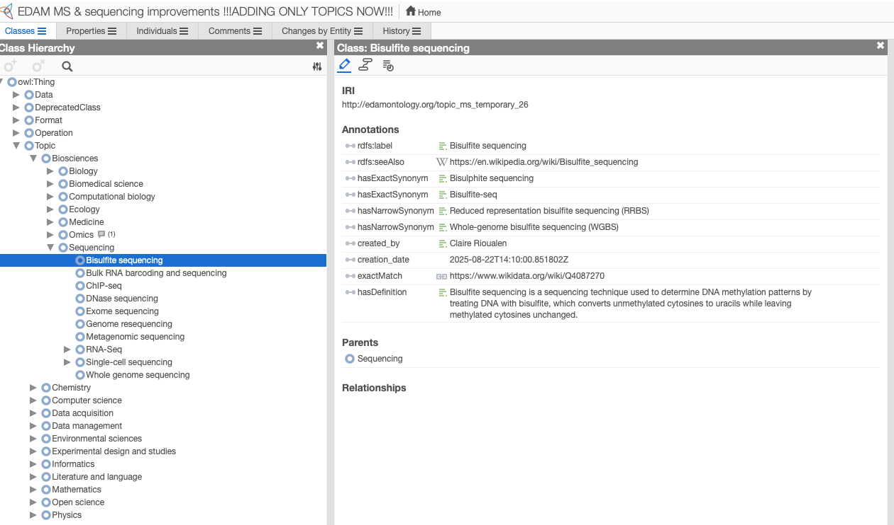

IRI: ... 
Parents: ... 
Annotations: ... 

CheckList for validating an EDAM term: 

*to do*


## Automated quality control of EDAM concepts 

**Minimal content**

*to do*

**Recommended content**

*to do*


## Exporting changes from WebProtege

The whole project can be exported from WebProtege as an RDF/XML file. This will create a zip file containing the OWL file, which should ideally be renamed.

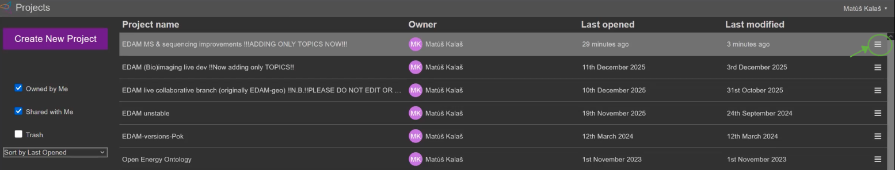

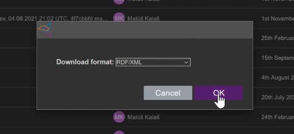

## Editing the EDAM file with new changes locally

Manually edit EDAM with the following steps:

- Open the WebProtégé OWL file and `EDAM_dev.owl` file in a text editor side-by-side

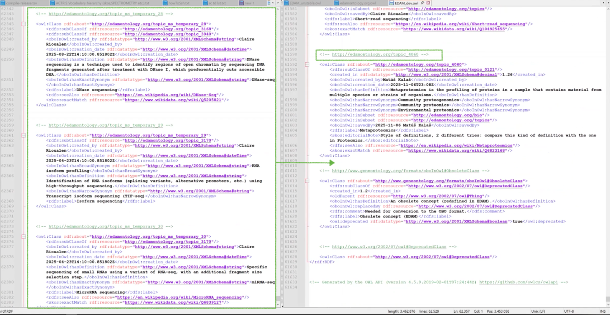

- Check the last ID used and increment this number accordingly for the new classes
- Check that the subClaffOf attribute is OK

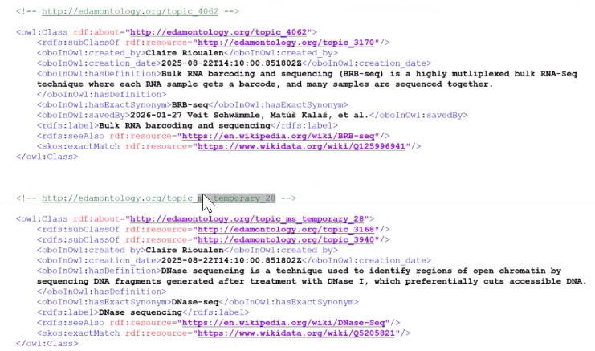

- Remove some unnecessary clutter added automatically by WebProtégé, like string declarations and such

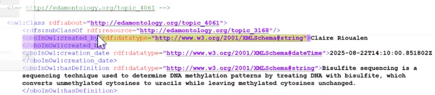

- Update the `next_id` and `date` attributes at the top of the EDAM file

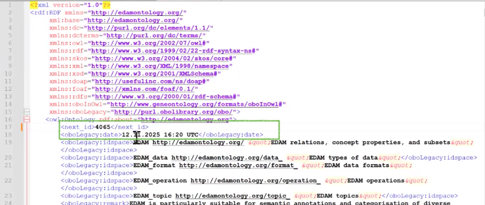


## Pushing edits to GitHub for versioning 

- Create new branch and add the edited EDAM file
- Revise the diff and make sure everything looks OK

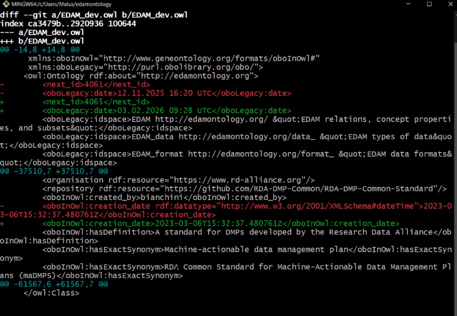

- Provide a detailed commit message, including author information and related issues or pull resquests

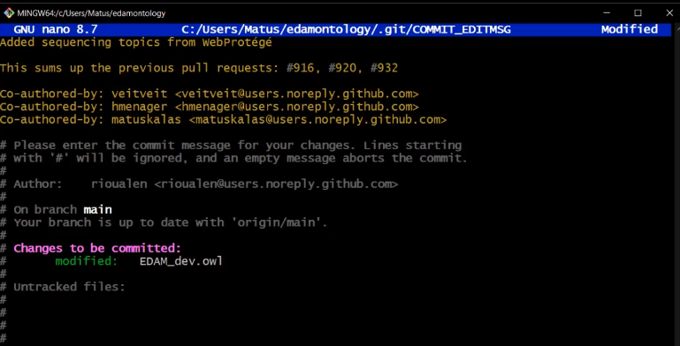
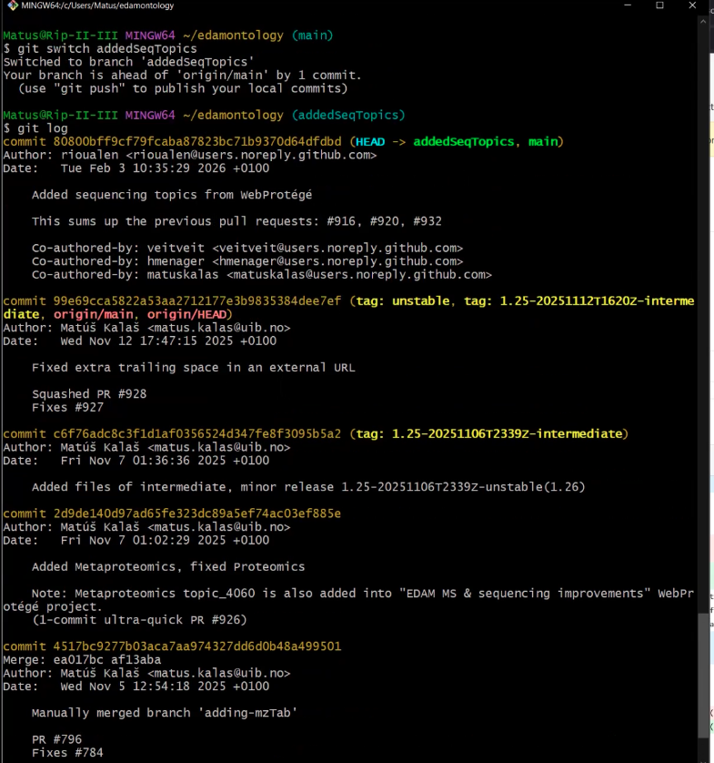

- Push changes from branch
- Open new branch on GitHub, revise the diff and open a new PR
- Make sure the CI runs smoothly
- Request reviewers for the pull request

## Updating the project on WebProtege

When the project on WebProtege is meant to keep evolving, the changes committed to GitHub need to be carefully incorporated - especially when WebProtege is behind the main versioned EDAM.

- In the text editor, the OWL file originally exported from WebProtege should be updated with the new permanent IDs, and the attributes `date`and `next_id`
- Revise the XML syntax, new IDs, last IDs added before 

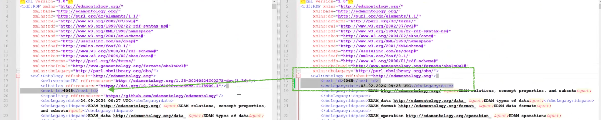

- Go back to WebProtege

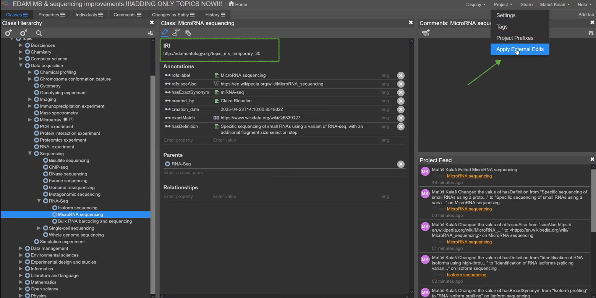

- Load the edited file and revise the changes to be applied: addition of new classes and permanent IDs, removal of temporary IDs, etc


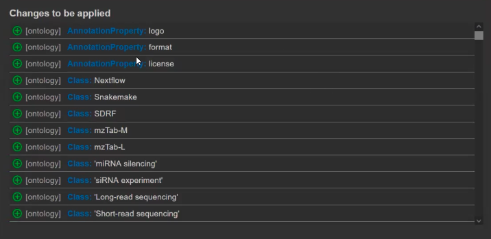
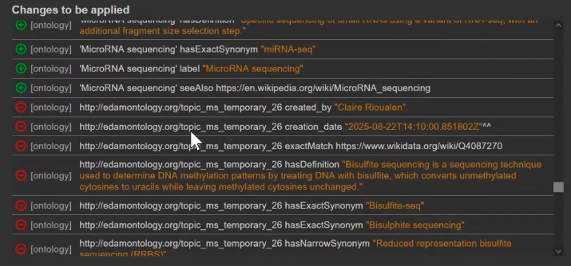

- Write a commit message and apply those changes

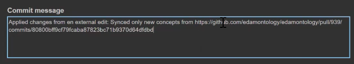
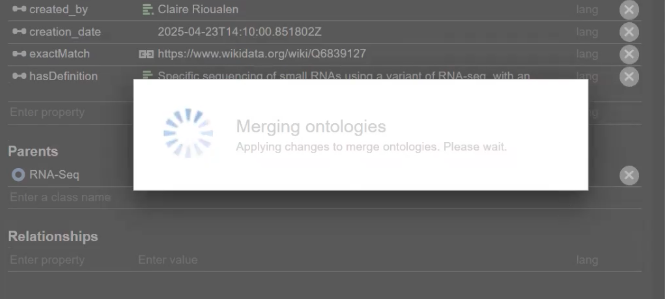
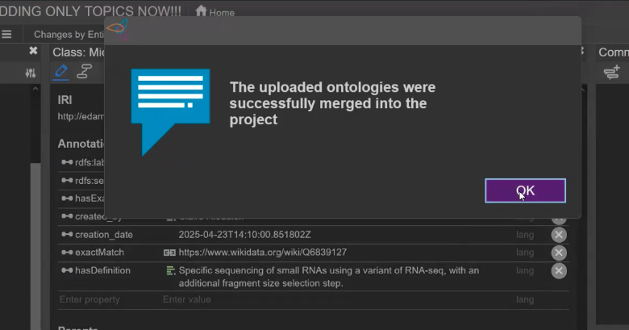

- Refresh the tree

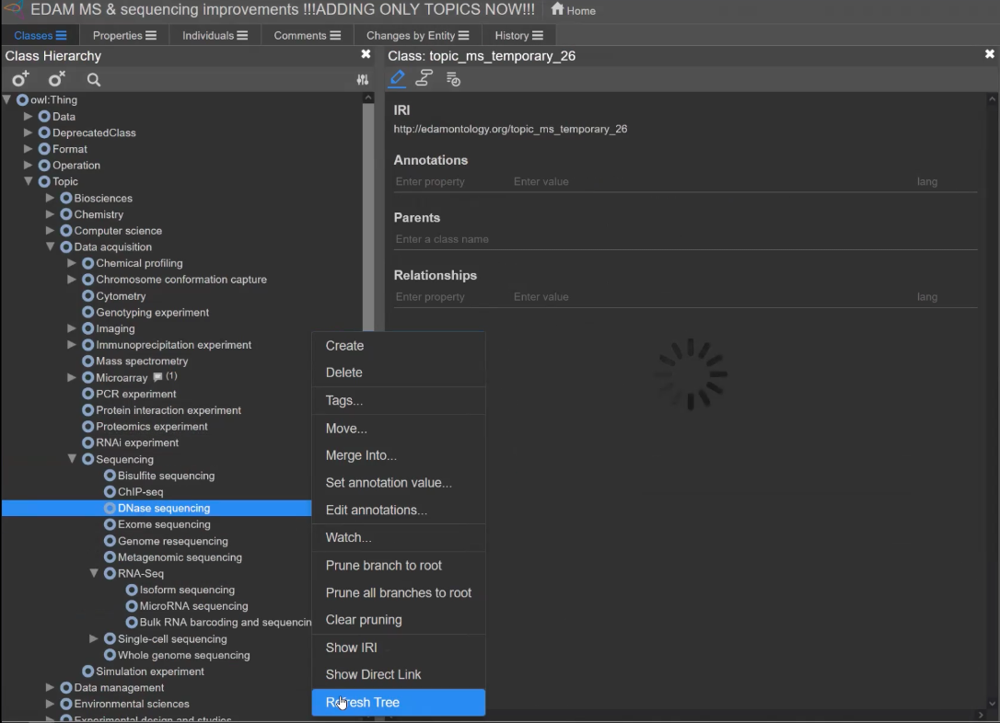

- The temporary IDs should be replaced with permanent IDs for the newly-committed classes

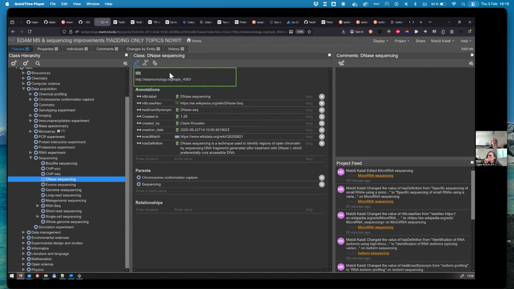

## Releasing a new version of the ontology

*to do*

## Starting with Git


### New to Git?

Some neat efficient learning resources are:
 - Quick introduction|refresh of [Git and GitHub](https://coderefinery.github.io/git-refresher/02-refresher/) (101)
 - Install Git: see [here](https://coderefinery.github.io/git-refresher/01-setup) and [here](https://carpentries.github.io/workshop-template/#git)
 - Install a convenient [text editor](https://coderefinery.github.io/installation/editors/) ([see also](https://carpentries.github.io/workshop-template/#editor))
 - [Learn Git](https://coderefinery.github.io/git-intro/) (great for both beginners and advanced)
 - [Forking and creating pull requests](https://coderefinery.github.io/git-collaborative/03-distributed/) on GitHub


### Git setup on your local machine

👉🏽 __Please make sure to read the following when you are cloning this repo:__ 👇🏽

1. We recommend using a "shallow" clone of the _edamontology_ repo, without all the history and open feature branches (unless investigating the history is what you want to do): `git clone --depth 1 https://github.com/edamontology/edamontology.git`

2. There is a __pre-commit [hook](https://coderefinery.github.io/git-collaborative/05-hooks/)__ set up, to validate that the source code of EDAM is in the right format. To make it work, please use one of the following 2 options:

😮 Wait a second! __Is this too fast? Do you need a slightly more step-by-step guide?__ Then you are welcome to follow issue [#616](https://github.com/edamontology/edamontology/issues/616).


#### Option 1

This is the preferred option. Your __git__ version needs to be __2.9.0 or higher__ for the hook to work, which is nowadays usually the case.

Please make sure to have set up the correct path to the hooks directory, locally or globally:

* Run `git config core.hooksPath` from inside of your forked and cloned _edamontology_ repo, and see if it returns the value `.githooks`.
* **If it doesn't, to set it locally for your _edamontology_ repo, run: `git config core.hooksPath .githooks`** inside your _edamontology_ repo.
* Alternatively, to set it globally for your Git: `git config --global core.hooksPath .githooks`.
* Tip: to see your Git config with where all the variables are stored, run `git config --list --show-origin` from inside of your _edamontology_ repo.


#### Option 2

If you have to|want to continue using an older version of __git__ than __2.9.0__, please either run the pre-commit script manually:
- Inside the _edamontology_ repo, run: `./.githooks/pre-commit`. If the script returns zero (`0`), the source code is invalid (_i.e._ not containing any _owl:Class_ string).

or better, **copy the files from the `.githooks` folder** in your _edamontology_ repo **into the `.git/hooks` folder** in your _edamontology_ repo. (Please do this again when the hooks scripts get updated and you pull the updates from the central _edamontology_ repo!)

#### Test that it's set up correctly:

1. Make a dummy change in `EDAM_dev.owl` using a text editor, and try to commit it to a **new, experimental Git branch** (see above if you need to learn or refresh Git: commits, branches). The commit should work, and you should see the output `Yay! Your commit to EDAM Ontology was successful.`.
2. Now replace all `owl:Class` in the `EDAM_dev.owl` file with for example `wol:Class` 🦉, and try to commit that change. The commit should fail now (returning `0`), not allowing you to commit.
3. (If you haven't done this in a new, experimental branch, reset the HEAD of your current branch (_e.g._ `main`) back to the last "proper" commit. If you have done it in an experimental branch, please make sure that you don't continue doing your next, "real" changes into this branch.😉)


## Other contributions

__Not wanting to edit an OWL file yourself? Also your ideas and requests are highly appreciated!__

We'll welcome your 📚**comments and suggestions**📑 in [WebProtégé](https://webprotege.stanford.edu/#projects/4befad5f-f27b-430c-a07d-fcf635093169/edit/Classes) (free registration required to view and comment) or in the [NCBO BioPortal](https://bioportal.bioontology.org/ontologies/EDAM?p=classes) (free registration required to add notes and suggestions). You are also welcome to request a new concept to be added to EDAM, using [an issue template](https://github.com/edamontology/edamontology/issues/new/choose), or other requests using a [generic issue](https://github.com/edamontology/edamontology/issues/new).🐱‍🚀

Please see [Getting involved](https://edamontologydocs.readthedocs.io/en/latest/getting_involved.html) for more ways to contribute to EDAM.😸🧬🌻

**Note:** There is a separate repository for [**EDAM-bioimaging**🔬](https://github.com/edamontology/edam-bioimaging) (including concepts for **Bioimage informatics** and **Machine learning**🤖), where contributions are very warmly welcome!🙌🏽 EDAM-bioimaging is abundantly commented in [WebProtégé](https://webprotege.stanford.edu/#projects/2ce704bf-83ed-4d2e-985f-84c4841fac71/edit/Classes) (free registration required to view and comment), and there is a possiblity to add notes and suggestions also in the [NCBO BioPortal](https://bioportal.bioontology.org/ontologies/EDAM-BIOIMAGING?p=classes) (free registration required to add notes and suggestions). 🚀 EDAM-bioimaging can also be editted directly on GitHub, and confirmed eager contributors will get edit rights directly on WebProtégé. [**Contribution details here.**](https://github.com/edamontology/edam-bioimaging#contributing) 🛰
